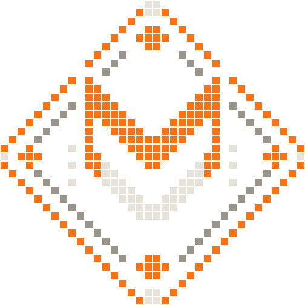
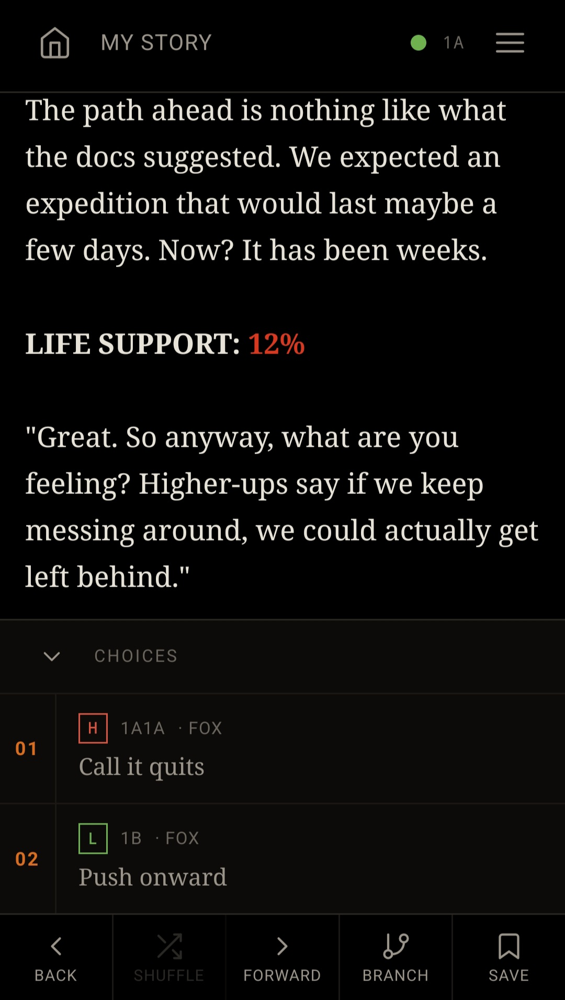
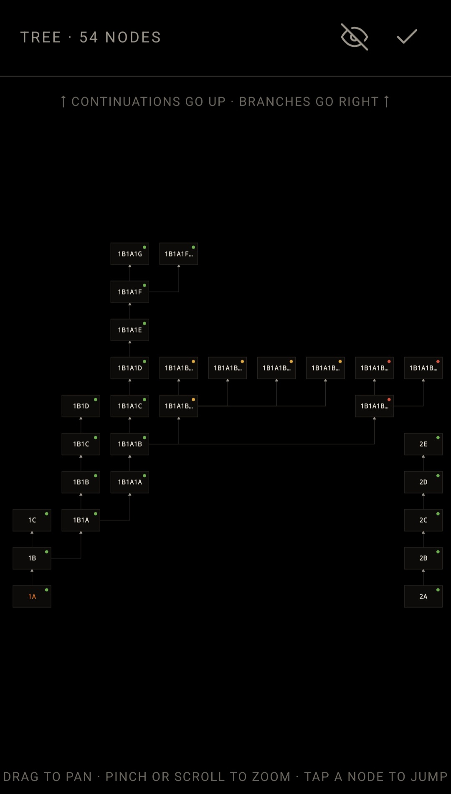
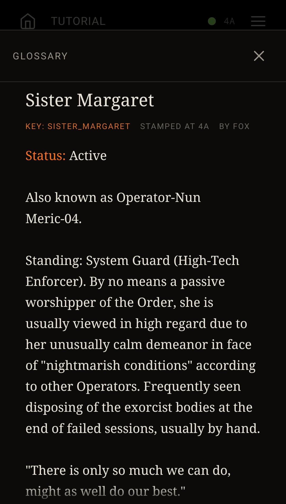
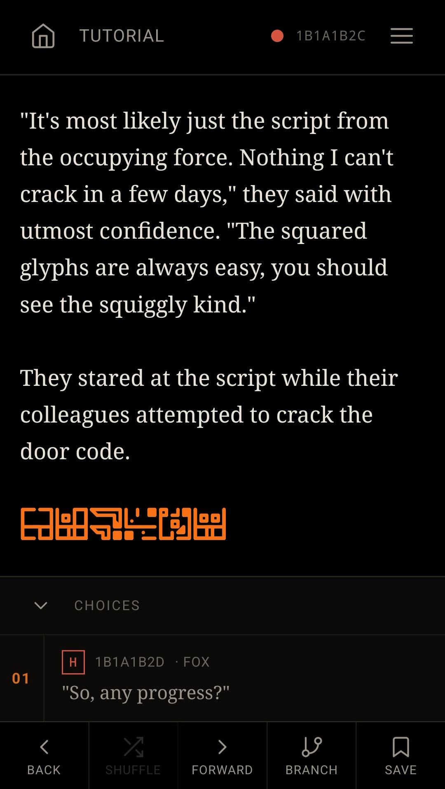
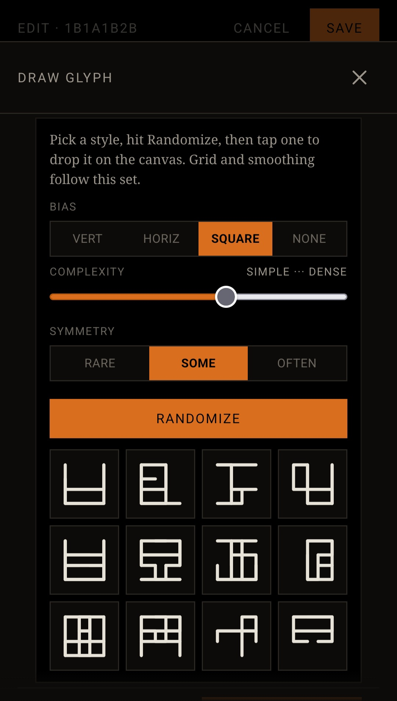
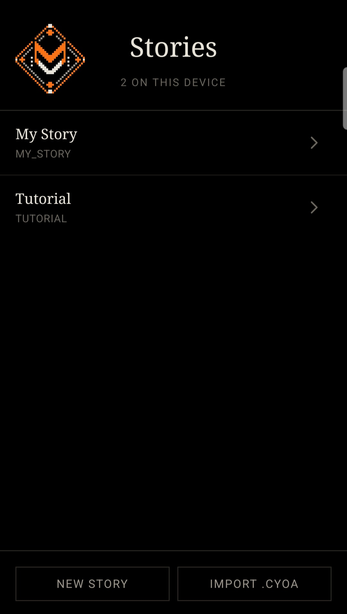

  

<h1 align="center">The Den</h1>

  <em>Write, branch, and read choose-your-own-adventure stories in a single file that runs entirely in your browser, online and offline.</em>

  
  
  
  
  

  <a href="https://foxden-labs.github.io/"><strong>&#9654;&nbsp; Open The Den</strong></a>

---

## What it is

The Den is a complete writer *and* reader for branching, choose-your-own-adventure stories, optimized for both mobile devices and PC. Write a story, worldbuild, or read someone else's work easily and comfortably, utilizing plenty of quality-of-life features designed for any writer.

It runs as one self-contained web page. Nothing to install, no account to make, nothing to configure. Simply open it and start writing.

> [!NOTE]
> **New here?** The Den ships with a full interactive tutorial built right in. It will teach you everything from basic navigation to in-depth editing within a self-contained tree.

## Why The Den

- **One file, fully offline.** The entire app lives in a single HTML file with zero external dependencies to fetch. Your stories are saved locally, right in your own browser, so once you download it, it never touches the network again. It works on a plane, in a basement, on dead Wi-Fi. Download it once and it's yours.
- **Minimal, industrial, neo-brutalist, terminal-core design.** Warm orange elements on a dark background, easy on the eyes and full of character. Designed specifically for eye comfort. Comes in several flavors, from Blackout to Flashbang, whatever your preference is.
- **Private by design.** Your writing never leaves your device. There's no server to send it to, so there's nothing to harvest, leak, or sell.
- **Free, and staying that way.** No ads. No tracking. No accounts. No upsell, ever. It's open source under the AGPL, which means it stays free and open *forever.* Anyone can read it, run it, fork it, and build on it.
- **Learn by doing.** That bundled tutorial takes you from "what is this" to writing in a single sitting of around 20 minutes or so.

## Writing and branching

### Isolated branches for narrative consistency

Stories in The Den are trees. Every node has an address, and from any node you can continue forward, split into new branches, or open whole parallel timelines with no complexity limits. Designed for fleshing out your fiction or creating deep and sprawling narratives with thousands of nodes. The addressing keeps everything straight and automated no matter how tangled it gets, so your attention stays on the story instead of the bookkeeping.

  
  &nbsp;
  

### Jump, don't merge — and the wiki that makes it work

Most branching tools eventually let you *merge* paths back together. The Den deliberately doesn't (for now, at least). Instead of merging, you **jump**: send the reader from one node to any other, anywhere in the story.

Why does that matter? Because of the **wiki integrity**.

The Den has a built-in glossary for tracking characters, places, or lore. It's **spoiler-proof by construction**. Every entry knows *where the reader is*. From the reader's current passage, the wiki crawls **backward** along the exact path they took and surfaces the most recent version of each entry that's actually been revealed up to that point. Nothing from further down the story ever bleeds through. A character who hasn't been introduced yet simply isn't there; one whose secret you've already uncovered shows the updated truth.

  

That only works because every passage carries one clean, honest history behind it. Merging two paths would fuse two different histories into one, and an entry written for one path would suddenly be lying on the other. So The Den omits merging and illusion of choice, while in exchange you get a wiki that always tells the reader exactly what they know, and never what they don't.

### Write naturally, format inline

You write in plain text, and a lightweight built-in parser turns simple markup into rich, interactive prose as you type:

- `((Open the door|2A))` — becomes a rendered button that sends the reader to another node.
- `[[The iron gate|iron_gate]]` — name and key system that lets you create unique entries, becomes an inline clickable link in the viewport. Completely safe and isolated from separate timelines sharing the same key.
- Plus **bold**, *italics*, underline, sizes, colors, and your own glyphs — all from quick bracketed syntax, with no menus to dig through.

### A glyph system of your own

Wish you could actually render inline eldritch or alien writing? The Den includes a custom glyph system, so you can define and drop your own runes, icons, and characters straight into the text. Anything from invented scripts, sigils, flourishes, whatever your setting calls for. It's one of the things that make worldbuilding fun.

Comes with an automated glyph generator to make things a little easier and give you a starting point if you'd like one. Includes several styles and a complexity scale. It's not AI, just math.

  
  &nbsp;
  

### Ratings and age-gating

Tag nodes with content ratings so mature material is gated appropriately and readers know what they're stepping into.

### Images

Drop images straight into the nodes. Whether it's illustrations, maps, or character art, it's all stored locally alongside the story so they travel with it through exports.

### Share anything — export, import, graft

Stories export to a single portable file and import just as cleanly. The standout trick is **grafting**: splice an imported story, or any part of one, into *any* point of an existing story. Import entire trees as a standalone branch and all the nodes rewrite their addresses automatically to facilitate it. 

## Use it

There's nothing to install.

1. **Online —** open [the hosted version](https://foxden-labs.github.io/).
2. **Local —** download `index.html` and open it in any modern browser. That single file *is* the whole app. Some browsers have a habit of "forgetting" html files, but all the data still gets saved. Put the file on your home screen and as long as you don't clear your browser history, everything will be waiting for you on reload. Alternatively, host it yourself on your own computer. The file is tiny so you won't even notice the performance hit.

  

## Roadmap

I have a lot of plans for this project since layering is incredibly easy. The code is built in a way that all new features can be slotted in with no issues. On the horizon: deeper interactive mechanics layered on top of the branching core, including a combat/encounter system that treats foes as puzzles to read and solve rather than dice to roll. More ways to turn a story into a *game*. 

## Contact

For any feedback or feature requests, the contact email is visible on my Github page and in the file itself in the side menu.

## License

Released under the **GNU Affero General Public License v3.0 or later** — see [`LICENSE`](LICENSE). In plain terms: you're free to use, study, modify, and share it, and any modified version you offer to others (including over a network) has to share its source too. Open, and staying open.

## Acknowledgments

- [Dexie.js](https://dexie.org) — the IndexedDB wrapper bundled in for local storage.

---

  Built by <a href="https://github.com/foxden-labs">foxden-labs</a>.

